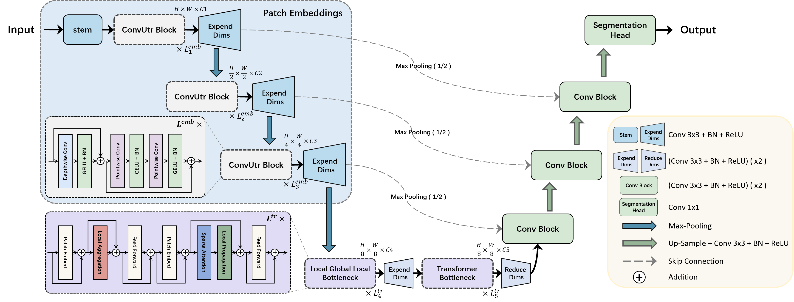
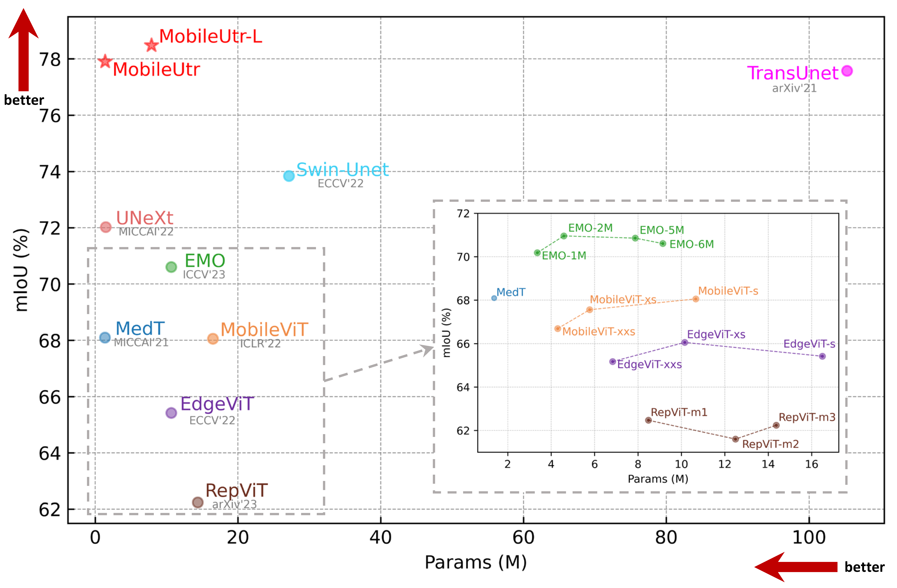

# MobileUtr: Revisiting the relationship between light-weight CNN and Transformer for efficient medical image segmentation

Official pytorch code for "MobileUtr: Revisiting the relationship between light-weight CNN and Transformer for efficient medical image segmentation"

- [ ] Code release
- [x] Paper release

## Introduction
Due to the scarcity and specific imaging characteristics in medical images, light-weighting Vision Transformers (ViTs) for efficient medical image segmentation is a significant challenge, and current studies have not yet paid attention to this issue. This work revisits the relationship between CNNs and Transformers in lightweight universal networks for medical image segmentation, aiming to integrate the advantages of both worlds at the infrastructure design level. In order to leverage the inductive bias inherent in CNNs, we abstract a Transformer-like lightweight CNNs block (ConvUtr) as the patch embeddings of ViTs, feeding Transformer with denoised, non-redundant and highly condensed semantic information. Moreover, an adaptive Local-Global-Local (LGL) block is introduced to facilitate efficient local-to-global information flow exchange, maximizing Transformer's global context information extraction capabilities. Finally, we build an efficient medical image segmentation model (MobileUtr) based on CNN and Transformers. Extensive experiments on five public medical image datasets with three different modalities demonstrate the superiority of MobileUtr over the state-of-the-art methods, while boasting lighter weights and lower computational cost.

### MobileUtr:



## Performance Comparison



## Datasets

Please put the [BUSI](https://www.kaggle.com/aryashah2k/breast-ultrasound-images-dataset) dataset or your own dataset as the following architecture. 
```
└── MobileUtr
    ├── data
        ├── busi
            ├── images
            |   ├── benign (10).png
            │   ├── malignant (17).png
            │   ├── ...
            |
            └── masks
                ├── 0
                |   ├── benign (10).png
                |   ├── malignant (17).png
                |   ├── ...
        ├── your dataset
            ├── images
            |   ├── 0a7e06.png
            │   ├── ...
            |
            └── masks
                ├── 0
                |   ├── 0a7e06.png
                |   ├── ...
    ├── dataloader
    ├── network
    ├── utils
    ├── main.py
    └── split.py
```
## Environment

- GPU: NVIDIA GeForce RTX4090 GPU
- Pytorch: 1.13.0 cuda 11.7
- cudatoolkit: 11.7.1
- scikit-learn: 1.0.2

## Training and Validation

You can first split your dataset:

```python
python split.py --dataset_name busi --dataset_root ./data
```

Then, train and validate:

```python
python main.py --model ["MobileUtr", "MobileUtr-L"] --base_dir ./data/busi --train_file_dir busi_train.txt --val_file_dir busi_val.txt
```

## Citation

If you use our code, please cite our paper:

```
@misc{tang2023mobileutr,
      title={MobileUtr: Revisiting the relationship between light-weight CNN and Transformer for efficient medical image segmentation}, 
      author={Fenghe Tang and Bingkun Nian and Jianrui Ding and Quan Quan and Jie Yang and Wei Liu and S. Kevin Zhou},
      year={2023},
      eprint={2312.01740},
      archivePrefix={arXiv},
      primaryClass={eess.IV}
}
```

